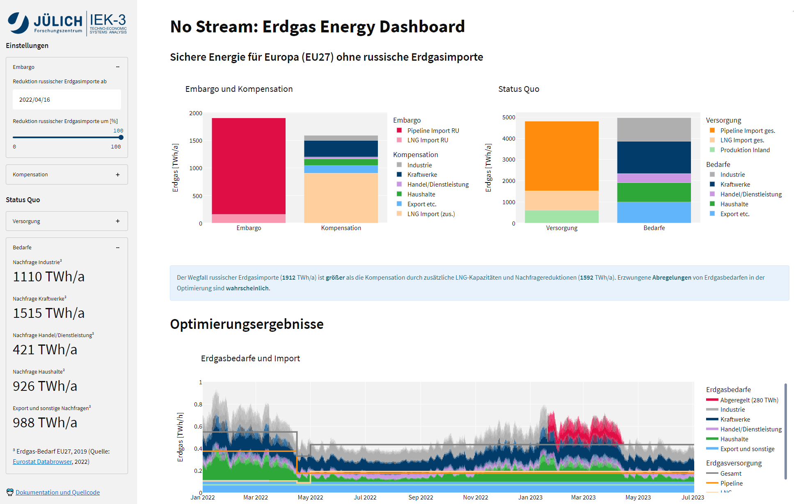

[](https://no-stream.fz-juelich.de/)


[](https://www.fz-juelich.de/iek/iek-3/DE/Home/home_node.html)

# Wie sicher ist die Energieversorgung ohne russisches Erdgas?

Mit dem Krieg in der Ukraine steht ein Stopp der Erdgaslieferungen aus Russland im Raum. Eine neue Web-Applikation (https://no-stream.fz-juelich.de/) des Forschungszentrums Jülich macht es nun möglich, die Folgen eines solchen – kompletten oder teilweisen – Embargos auf die deutschen Erdgasvorräte zu ermitteln.

[](https://no-stream.fz-juelich.de/)

## Setup and develop

In order to locally develop the application, install anaconda and run

```bash
pip install -r requirements.txt
```

afterwards activate the environment, move into the streamlit repository and start streamlit with:

```bash
streamlit run ./streamlit/streamlit_app.py
```

## Setup and develop (Docker)

If you have docker and docker-compose installed, install the environment and dependencies by running:

```bash
docker-compose -f docker-compose-dev.yml up -d --build
```

Access the home app through:

```bash
localhost:8501
```

<!-- Access the compact app through:

```bash
localhost:8502
``` -->

## Change log

#### v0.4 - 14.07.2022
- receive Eurostat data via API call
- receive daily storage level data via API call from AGSI, GIE

#### v0.3 - 20.04.2022
- Allow predefined minimum state of charge levels for the natural gas storages according to EU regulation (COM(2022) 135)
- Apply a dynamic start date for the demand reduction (starts today), the embargo (starts 4 weeks from today) and the increase of imports (starts 6 weeks from today)
- Option to increase pipeline imports from Norway, Algeria, and the UK
- Add caching functions to improve performance: Optimizations with the same inputs as a previous run can be loaded from cache.
- Fixed: No demand curtailment before the current date

#### v0.2 - 04.04.2022
- Add the possibility to add additional pipeline imports, e.g., from Norway
- Reduce also LNG imports from Russia with a starting embargo
- Change the merit order of curtailemt, with the industry first and export last

#### v0.1 - 30.03.2022
- First publice release
